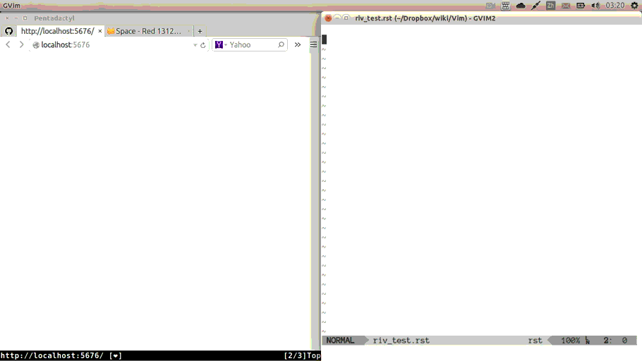

#######################
Riv: Take Notes in rst
#######################

    The Internet is just a world passing around notes in a classroom.

    -- `Jon Stewart`_

:Last Update: 2014-08-14
:Version: 0.77


Changes in 0.77
===============

Lots of changes were made, so take care, and

   **DON'T PANIC!**

1. A brand new html theme for riv, 
   provides much better view experience in browser.

   You can preview it at http://rykka.github.io/rhythm.css/test

   Also, code syntax highlighting and themes are now truly supported,
   you can change the theme by setting ``g:riv_html_code_hl_style``, 
   default is 'molokai'. 
   (This option may change to ``g:riv_code_theme`` in future.)

   You can add your theme's css dir at ``g:riv_css_theme_dir``.
   then set the style to the filename.

   For view and edit in vim, you can use most morden themes like molokai.
   And the Galaxy.vim_ can be a good choice too.

2. Auto convert to html on ``:w``:

   Use option ``g:riv_auto_rst2html``, set it to 1 to active.
   default is 0. 

   If you even don't want to refresh the browser, use InstantRst_.

3. New syntax and method for local files, 
   which is much simpler, and robust.

   see `#72`_ for details.

   Just input ``xxx.rst`` or ``xxx/``,
   Then use ``:RivCreatLink`` or ``<C-E>ck``, 
   you will get the file link.

   When click on a reference which location is a file link,
   you will open it directly.

   To disable this, set ``g:riv_open_link_location`` to 0.
   Then you will move to that location only.
   default is 1.

   :NOTE: When convert to html,
          the xxx.rst in the file location will be auto convert
          to xxx.html for navigation in browser.
   
   :NOTE:

       The moinmoin style (``[[xxxx]]``) is deprecated, and will be removed
       in next few versions.

       The sphinx style (``:doc:`xxxx```) will go on.

4. Unicode Link names.

   Reference links now supporting unicode names.

   Also filename supports unicode names too, 
   though that's not encouraged.

   like::

       名字_

       .. 名字: name.rst

5. Better and faster indent behavior.

   see `#71`_ for details.

6. Fixed lots of misc bugs and made lots of small optimization

   The error phase ptn. 

   Project's id working error.

   Editing a file missing working directory.

   Syntax highlighting error and optimize.

   Improved doctest using doctest.vim_

   ...

----

   **And**

Please help improving this plugin, for better writing and reading.

Both bug reports and suggestions are welcome.

Many Thanks!

Intro
=====

**Riv** is a vim plugin for taking notes with reStructuredText_.

A screencast with Riv in vim and InstantRst_



Comparion
=========

First things first.

As there are some other note plugins in vim. 
like vimwiki_, vim-notes_,  VOoM_ etc.

Also org-mode_ if you are Emacs fan.

**Why using this plugin?**

In comparition, the most advantage of **Riv.vim** is reStructuredText_ support. 

    reStructuredText is a markup language.

    It's syntax are markdown_ alike, but more powerful and extensible, table, LaTex ect. are supported.

    It's widely used in python community. And have many relevent plugins. Sphinx_ (www.readthedocs.org) Pygments_, Nikola_, etc.

    There is a post of comparions between reStructuredText and markdown https://gist.github.com/dupuy/1855764


Features
========

**Wiki**  
    Write wiki with project and file link support. **TODO** syntax is added.
**Editing**   
    Faster typing, easier navigation, clear intending, auto formatting etc.
**Reading** 
    Improved syntax highlighting and folding support for reading document clearly.
**Publish** 
    Convert rst files to a number of different formats: pdf, html, xml, latex and odt etc.
    sofish's typo.css_ is added for better performance. 
**Plugins**   
    Support many plugins like Sphinx_ syntax support.
    Other rst plugins:

    - Vim & Python: InstantRst_ for preview rst document instantly.
    - Vim & Python: Syntastic_ for syntax checking. Requires Docutils_ and Pygments_.
    - Python: Sphinx_ for Sphinx users.
    - Python: Nikola_ for static blogging with rst syntax.
    - Python: HoverCraft_ for writing presentation from rst.

    Contribution to this list are welcome.

Installation
============

Using Vundle_
-------------

**Recommended**
Add this line to your .vimrc (after you
have properly set up Vundle_)::
 
    Bundle 'Rykka/riv.vim'

Downloaded zip/tar.gz file
--------------------------

Extract the contents of the archive to your ``.vim`` directory.

Config
------

You can add projects with ``g:riv_projects``::

    let proj1 = { 'path': '~/Dropbox/rst',}
    let g:riv_projects = [proj1]

More options see the ``:RivInstruction``

Make sure your .vim directory is before $VIMRUNTIME in 
``runtimepath``.  By default it *IS* present before $VIMRUNTIME.

Also Make sure ``filetype plugin indent on`` and ``syntax on`` options
are present in your .vimrc.

Related tools
-------------


Tutorials
=========

You can have a quick start with ``:RivQuickStart``.

Here is the Screencast: 

* Riv: QuickStart_ (HD)


New To Vim
----------

* If you are new to Vim, you can get a basic overview of Vim using
  ``vimtutor``. To use it simply type ``vimtutor`` in your shell.
  
* To view the quick reference of Vim, use ``:h quickref``.

New TO Rst
----------

* To get a quick overview of reStructuredText, some of the available options
  are:

  Read "`A ReStructuredText Primer`_". You can use ``:RivPrimer`` to open it in
  Vim. Or, you can read "`Quick reStructuredText`_".

* For a detailed look at reStructuredText's specifications, take a look at
  "`reStructuredText Specification`_". You can use ``:RivSpecification`` to
  open it in Vim.

* Finally, you can use "`reStructuredText cheatsheet`_" for a quick review. Use
  ``:RivCheatSheet`` to open it in Vim.

New To Riv
----------

* For getting started with Riv, read "`QuickStart With Riv`_".
  You can also view it using ``:RivQuickStart`` in Vim.

* Detailed instructions for Riv are available at "`Instructions`_". Use
  ``:RivInstruction`` to read the same in Vim.

Issues
======

The bug tracker for Riv is at https://github.com/Rykka/riv.vim/issues.
You can use it to report bugs and open feature requests. Discussions related
to Riv are welcome too. 

You can follow my twitter `@rykkaf`_ and notice me there too.

Common Issues
-------------

* If you get errors with folding in documents, you can try to force reload
  using ``:RivReload`` or ``<C-E>t```.

  Or just `:w` as it will auto refolding after saving.

* Windows:
  
  - Converting to other formats may fail. 
    
    This could happen due to Docutils not working correctly with
    ``vimrun.exe``.

* Mac OS:

  - Lists don't act as expected.
  
    This could happen if the ``<C-Enter>`` key could not be mapped. Try some
    other mapping instead.


.. _Vim text editor: http://www.vim.org/
.. _reStructuredText: http://docutils.sourceforge.net/rst.html
.. _Sphinx: http://sphinx.pocoo.org/
.. _QuickStart: http://www.youtube.com/watch?v=sgSz2J1NVJ8
.. _Instructions: https://github.com/Rykka/riv.vim/blob/master/doc/riv_instruction.rst
.. _A ReStructuredText Primer: http://docutils.sourceforge.net/docs/user/rst/quickstart.html
.. _Quick reStructuredText: http://docutils.sourceforge.net/docs/user/rst/quickref.html
.. _Quickstart With Riv:
   https://github.com/Rykka/riv.vim/blob/master/doc/riv_quickstart.rst
.. _Vundle: https://www.github.com/gmarik/vundle
.. _Docutils: http://docutils.sourceforge.net/
.. _Pygments: http://pygments.org/
.. _Syntastic: https://github.com/scrooloose/syntastic
.. _riv_log: https://github.com/Rykka/riv.vim/blob/master/doc/riv_log.rst
.. _riv_todo: https://github.com/Rykka/riv.vim/blob/master/doc/riv_todo.rst
.. _reStructuredText Specification: http://docutils.sourceforge.net/docs/ref/rst/restructuredtext.html
.. _reStructuredText cheatsheet: http://docutils.sourceforge.net/docs/user/rst/cheatsheet.txt
.. _vimwiki: https://github.com/vimwiki/vimwiki 
.. _vim-notes: https://github.com/xolox/vim-notes 
.. _markdown: http://daringfireball.net/projects/markdown/
.. _org-mode: http://orgmode.org/
.. _Jon Stewart: http://en.wikipedia.org/wiki/Jon_Stewart 
.. _Nikola: https://github.com/getnikola/nikola
.. _`@rykkaf`: https://twitter.com/rykkaf
.. _InstantRst: https://github.com/Rykka/InstantRst
.. _HoverCraft: https://github.com/regebro/hovercraft
.. _typo.css:  https://github.com/sofish/Typo.css 
.. _Galaxy.vim: https://github.com/Rykka/galaxy.vim
.. _VOoM: https://github.com/vim-voom/VOoM
.. _doctest.vim: https://github.com/Rykka/doctest.vim
.. _`#71`: https://github.com/Rykka/riv.vim/issues/#71
.. _`#72`: https://github.com/Rykka/riv.vim/issues/#72
